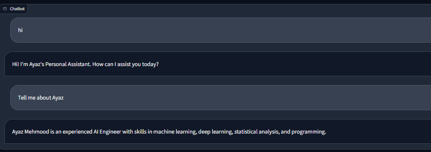

The RAG conversation bot is designed to talk about my resume. I have created vector embeddings of my resume and saved them to VectorDB. The conversation bot is instructed to answer user questions by extracting information from VectorDB.
 

